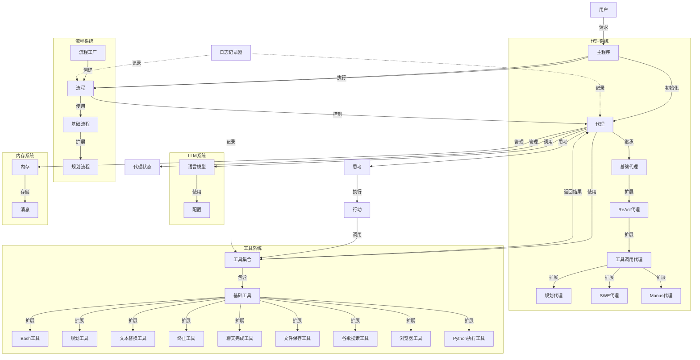
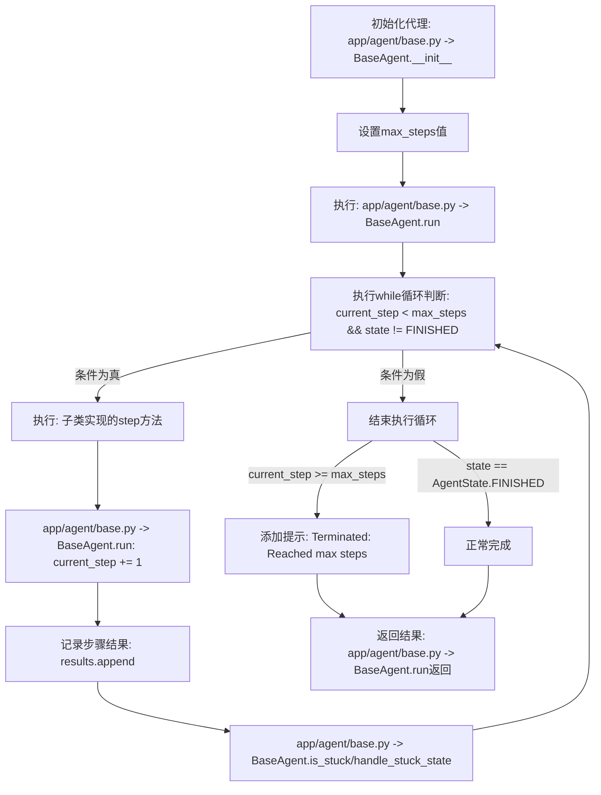

# 执行流程图

我将为您创建一个Mermaid格式的执行流程图，展示应用程序的主要组件和它们之间的交互关系。

## 执行流程说明

1. **用户交互**：
   - 用户通过主程序发送请求
   - 主程序初始化适当的代理或流程

2. **代理系统**：
   - `BaseAgent`：所有代理的基类，提供核心功能
   - `ReActAgent`：实现思考-行动循环的代理
   - `ToolCallAgent`：能够调用工具的代理
   - `PlanningAgent`：使用规划工具创建和执行计划的代理
   - `SWEAgent`：软件工程代理，专注于编程任务
   - `Manus`：通用代理，集成多种工具

3. **流程系统**：
   - `BaseFlow`：基础流程类，管理多个代理
   - `PlanningFlow`：规划流程，协调多个代理执行计划
   - `FlowFactory`：创建不同类型的流程

4. **工具系统**：
   - `BaseTool`：所有工具的基类
   - 多种专用工具：Bash、规划、文本编辑、终止等
   - 特殊工具：文件保存、谷歌搜索、浏览器、Python执行

5. **LLM系统**：
   - 语言模型接口，处理与OpenAI或Azure的通信
   - 配置管理，加载和存储设置

6. **内存系统**：
   - 管理代理的对话历史
   - 存储不同类型的消息（用户、系统、助手、工具）

7. **执行循环**：
   - 代理通过思考-行动循环执行任务
   - 工具被调用并返回结果
   - 流程协调多个代理的执行

8. **状态管理**：
   - 跟踪代理的状态（空闲、运行中、完成、错误）
   - 日志系统记录整个执行过程

这个流程图展示了应用程序的主要组件和它们之间的关系，帮助理解系统的整体架构和执行流程。

# max_steps执行流程分析（含文件名和函数名）

## 相关代码关系说明

- **文件路径**: `app/agent/base.py`
  - **主要类**: `BaseAgent` - 定义了基础执行流程和抽象方法
  - **关键方法**: 
    - `run()` - 执行主循环，控制步数限制
    - `step()` - 抽象方法，由子类实现实际步骤执行逻辑
    - `is_stuck()` - 检测代理是否陷入循环
    - `handle_stuck_state()` - 处理卡住状态

- **子类实现**:
  - `app/agent/react.py`: `ReActAgent` (max_steps=10)
  - `app/agent/toolcall.py`: `ToolCallAgent` (max_steps=30)
  - `app/agent/planning.py`: `PlanningAgent` (max_steps=20)
  - `app/agent/swe.py`: `SWEAgent` (max_steps=30)
  - `app/agent/manus.py`: `Manus` (继承自ToolCallAgent，max_steps=30)

- **终止条件**:
  1. `current_step >= max_steps`: 达到步数上限
  2. `state == AgentState.FINISHED`: 通常由`Terminate`工具触发，表示任务完成

执行过程会在每次步骤后检查是否达到条件，因此实际执行步数可能少于设定的`max_steps`值。
